# vault-engine

[English](README.md) · **简体中文**

**给一切要粘进云端大模型的文本，加一层本地大模型隐私层。**

在文本到达 ChatGPT / Claude / Gemini **之前**，先把身份信息脱掉——一个跑在**你自己电脑上**的模型找出人名、机构、地点和准标识符，替换成稳定代号，并把"代号↔真名"这唯一的钥匙留在本地。云端用代号回复后，你在本地把真实身份还原回来。

*尽力而为的脱敏——不是法律意义上的匿名化，也不是隐私保证。高敏感材料发送前请人工复查。*

> 出云前做身份脱敏：本地模型检测 → 代号化 → 云端用代号分析 → 本地还原真身。
> 检测**不出本机**，身份映射**只存本地**，大模型**一行换**。零依赖。

<p align="center">
  
</p>


&nbsp;·&nbsp; Python ≥3.9 &nbsp;·&nbsp; 纯标准库 &nbsp;·&nbsp; Apache-2.0

```text
# notes.txt  ── 私有，留在你电脑上
林若曦是星澜资本的合伙人，在深圳见了字节跳动的陈大壮，邮箱 lin@xinglan.example

        ▼  vault-engine scrub  （本地 qwen3.6:27b）

# safe.txt  ── 云端只看到这个：身份已被换成代号
P-n1 是 ORG_1 的合伙人，在 LOC_1 见了 ORG_2 的 P-n2，邮箱 EMAIL_1
```

---

## 为什么需要它

你想让前沿云端模型分析敏感笔记——但不想让云端知道这些内容**是关于谁的**。只屏蔽你已知的名字，会漏掉你不知道的一切：一个没登记的人名、一个雇主、"某城市 + 某罕见职务"、一个项目代号。基于规则的正则脱敏，根本看不见这些。

`vault-engine` 在最前面放一个**本地模型**当检测器，于是语义层面的身份也能被抓到——而且除了脱敏后的文本，什么都不会离开本机。

## 工作原理

```
 private text                                    cloud model
      │                                          (sees only tokens)
      ▼                                                ▲
┌─────────────────────────── vault-engine ────────────┼───────────┐
│  ① regex PII detectors  (offline floor)              │           │
│  ② LLM detector         (local model finds names,    │           │
│                          orgs, places, quasi-IDs)    │           │
│  ③ consistent pseudonyms (张三→P-n1, 同名同号)        │           │
│  ④ residual-risk critic  (re-scan: anything left?)   │  ① send   │
│        │                                             │           │
│   sanitized text ────────────────────────────────────┘           │
│        ▲                                                          │
│   reverse map (token → real identity) ── stays LOCAL ──┐  ② reply │
│        └───────────────────── ⑤ rehydrate ◀────────────┘          │
└──────────────────────────────────────────────────────────────────┘
      ▼
 real identities restored locally → use in your own system
```

## 评测 benchmark

在一个带标注的双语数据集上，各检测器到底能抓到多少身份（用 `python eval/run_eval.py` 可复现；方法学见 [`eval/`](eval/README.md)）：

> ⚠️ 这是一个**小规模合成集**，仅用于回归测试和粗略对比——**不代表**法律意义上的匿名化或完整隐私保护。"召回"指"被标记去脱敏"；LLM 检测是非确定性的。详见 [威胁模型](#威胁模型与局限诚实)。

| 检测器 | 人物 | 机构 | 地点 | 项目 | 联系方式 | 证件 | **总召回** | 过度脱敏 |
|---|---|---|---|---|---|---|---|---|
| 纯正则 | 0% | 0% | 0% | 0% | 69% | 33% | **13%** | 0% |
| Microsoft Presidio (en/zh `lg`) | 78% | 59% | 80% | 33% | 38% | 0% | **61%** | 4% |
| vault-engine (qwen2.5:7b, 4.7 GB) | 100% | 100% | 100% | 100% | 100% | 100% | **100%** | 2% |
| vault-engine (qwen3.5:9b, 6.6 GB) | 100% | 94% | 100% | 100% | 100% | 100% | **99%** | 0% |
| **vault-engine (qwen3.6:27b, 17 GB)** | 100% | 100% | 100% | 100% | 100% | 100% | **100%** | 0% |

同一份数据集上 Presidio 的 NER 拿 61%，本地大模型清到 ~100%——差距最大的是**项目代号、@账号、证件号、以及中文人名/机构**。**检测并不需要大模型**：4.7GB 的 `qwen2.5:7b` 与 27b 同样打满召回，约 4 秒/篇（27b 约 25 秒/篇），普通笔记本即可。Presidio 在其覆盖范围内仍然快得多（约 0.4 秒/篇）。

重点不是刷榜，而是**形态差异**：纯模式匹配对人名、机构、地点、代号**完全失明**，本地大模型能看见。

## 安装

```bash
pip install vault-engine
```

或直接从源码装最新版：

```bash
pip install git+https://github.com/fishonbike/vault-engine
```

默认后端用本地 [Ollama](https://ollama.com)，先拉个模型：

```bash
ollama pull qwen3.6:27b
```

还没装模型？确定性的正则兜底（邮箱、电话、证件、卡号、URL）零配置即可用，加 `--no-llm` 即可。

## 快速上手

```bash
vault-engine scrub notes.txt -o notes.safe.txt
```

它会写出 `notes.safe.txt`（这份发给云端）和 `notes.safe.txt.map.json`（**只存本地**——里面是真实身份）。把脱敏文本粘进你的模型，存下它的回复，再还原真实身份：

```bash
vault-engine rehydrate reply.json --map notes.safe.txt.map.json -o reply.real.json
```

### 剪贴板一行流

最快的用法——贴进聊天机器人前，就地把剪贴板洗一遍：

```bash
vault-engine clip               # 脱敏当前剪贴板
#   …粘进 ChatGPT/Claude，复制它的回复，然后：
vault-engine clip --rehydrate   # 把剪贴板里的代号还原成真实身份
```

支持 macOS、Windows、Linux（Linux 需 `xclip`/`xsel`/`wl-clipboard`）。

库调用：

```python
from vaultengine import deidentify, rehydrate, Config

result = deidentify(open("notes.txt").read(), Config(model="qwen3.6:27b"))
send_to_cloud(result.text)                  # 只有代号出门
restored = rehydrate(get_cloud_reply(), result.vault)   # 本地还原真实身份
result.vault.save("notes.map.json")         # 反向映射——留在本地
```

## 适用场景

- **贴进 ChatGPT/Claude 前先假名化**——分析私密笔记、合同、聊天记录时，先把直接标识符脱掉。
- **共享或喂给 LLM 前脱敏日志与工单**。
- **匿名化一份数据集**做 LLM 辅助分析，再把结果映射回去。
- **气隙式审阅闭环**——锁死环境里的模型自始至终只看到代号。

## 与其他方案的对比

Presidio 和 LLM Guard 都是优秀、成熟的工具。vault-engine 的赌注不同：用**本地大模型**当检测器，抓住基于标签的 NER 漏掉的语义/准标识符，并且**零运行时依赖**、中文一流。

| | **vault-engine** | Presidio | LLM Guard (Anonymize) | regex / scrubadub |
|---|---|---|---|---|
| 检测方式 | 本地 LLM + 正则 | NER (spaCy) + 正则 | NER / transformers | 仅正则模式 |
| 未登记人名 / 机构 / 准标识符 | ✅ LLM | ⚠️ 仅 NER 标签 | ⚠️ 受限于 NER | ❌ |
| 可逆往返 | ✅ 本地映射 | ✅ 反匿名化 | ✅ Vault | ❌ |
| 完全本地 / 离线 | ✅ Ollama | ✅ | ⚠️ 视情况 | ✅ |
| 运行时依赖 | **无（纯标准库）** | spaCy + 模型 | 若干 | 视情况 |
| 中文 | ✅ 强 | ⚠️ 需模型 | ⚠️ | ❌ |
| 换模型 | ✅ 一行 | — | 部分 | — |
| 检测失败即报错 | ✅ 降级 + 非零退出 | — | — | — |

## 脱敏力度（隐私 ↔ 可用性）

| `--policy`  | 人物 | 机构 / 地点 / 职务 | 日期 | 代号形态 |
|-------------|------|-------------------|------|---------|
| `balanced` *(默认)* | ✅ | ✅ 带类型（`ORG_1`、`LOC_2`） | 保留 | 类型化 |
| `max`       | ✅ | ✅ 不透明 `R_1`（隐藏类型） | 粗化 | 不透明 |
| `light`     | ✅ | 原样保留 | 保留 | 类型化 |

`balanced` 保留粗粒度结构——云端仍能读到"`ORG_1` 在 `LOC_1` 把 `P-n2` 招为 `ROLE_1`"并据此推理，但没有任何真实身份出门。**人物在任何力度下都会被代号化。**

## 换模型

```bash
vault-engine models                                   # 列出本地 Ollama 已装模型
vault-engine scrub notes.txt --model qwen3.6:35b-a3b  # 任意本地模型
vault-engine scrub notes.txt --provider null          # 离线，仅正则
```

内置 provider：`ollama`（默认）、`openai-compat`（任意 OpenAI 兼容端点——选用；⚠️ 会把原文发往该端点）、`null`（离线）。实现一个方法（`complete`）并注册，即可接入你自己的后端。

## ⚠️ 安全模型——务必阅读

- **反向映射 `*.map.json` 就是身份本身。** 它是把代号链回真人的唯一东西。只存本地，绝不发给云端、绝不提交进仓库——`.gitignore` 已屏蔽 `*.map.json`，CLI 每次运行都会提醒。加 `--one-way` 可不产出映射（不可逆发布）。
- **检测默认全程本地。** 只有脱敏后的文本才该离开本机，且只在你主动发送时。

## 威胁模型与局限（诚实）

- LLM 检测是**尽力而为，不是不可识别的保证**——模型可能漏掉一个名字或一个罕见的准标识符。它**不是** k-匿名，也不是差分隐私。
- 残留风险复审和风险报告能降低并暴露残留风险，但不能证明其不存在。即便去掉名字，文风和领域独有事实仍可能定位到人——高敏材料请用 `max`。
- 模型后端不可达时，运行会**降级为纯正则并以非零退出**（`--allow-degraded` 可覆盖）——它绝不会静默吐出脱敏不足的文本。

## 保护代码与 schema（`--format markdown`）

加 `--format markdown`（或 `auto`，遇到围栏代码块自动开启）时，围栏 ``` 代码块内的内容会原样保留——你为模型附带的 JSON 回执 schema 或代码样例不会被动，而周围的正文照常脱敏。文本中已存在的占位符（如 `P-7`）也原样穿过。

## 开发

```bash
python -m unittest discover -t . -s tests -v   # 全部单元测试，离线、无需模型
python eval/run_eval.py --provider ollama       # 复现 benchmark
```

全程离线、确定性（用 null/fake provider）；所有 fixture 都是合成数据——本仓库不含任何真实数据。

## 许可证

Apache-2.0 © 2026 fishonbike。见 [LICENSE](LICENSE) 与 [NOTICE](NOTICE)。
